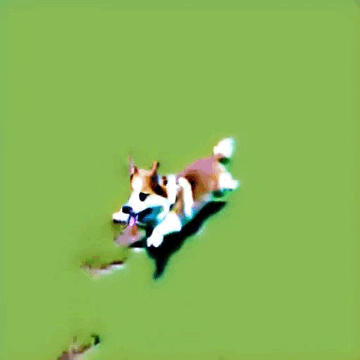
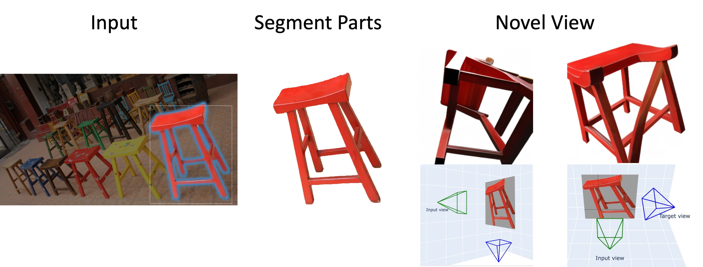
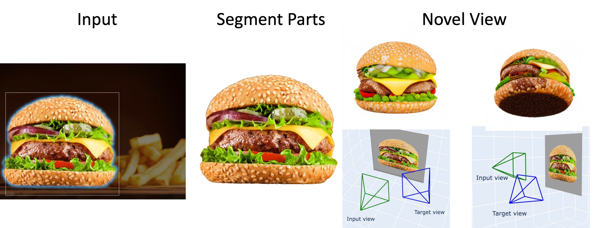
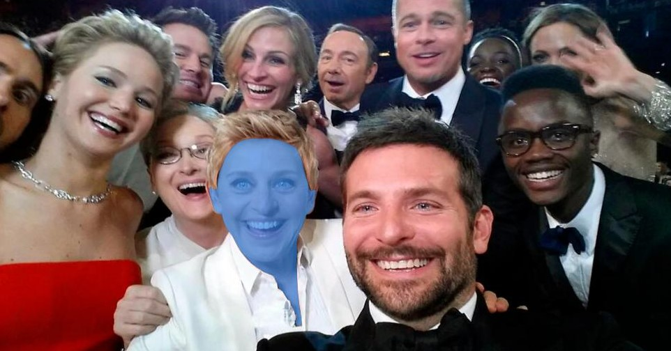
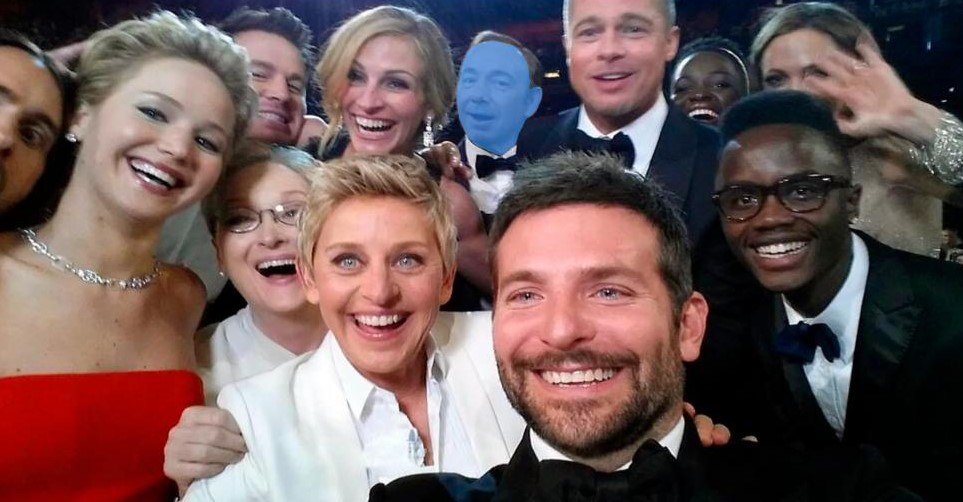

<!-- # Anything-3D -->


🎉🎉🎉Welcome to the Anything-3D GitHub repository!🎉🎉🎉 


Here we present a project where we combine [Segment Anything](https://github.com/facebookresearch/segment-anything) with a series of 3D models to create a very interesting demo. This is currently a small project, but we plan to continue improving it and creating more exciting demos.

**Contributions are highly Welcomed!🤝🙌**


- [🤩 Anything-3D-Objects](#-anything-3d-objects)
- [🔥 Anything-3DNovel-View](#-anything-3dnovel-view)
- [😎 Any-3DFace](#-any-3dface)
- [:cupid: Acknowledgements](#cupid-acknowledgements)
- [Citation](#citation)

## 🤩 Anything-3D-Objects

In this section, we showcase the results of combining [Segment Anything](https://github.com/facebookresearch/segment-anything) with [3DFuse](https://github.com/KU-CVLAB/3DFuse) to segment and reconstruct 3D objects in the wild. Check out the following table for segmentation results and the corresponding 3D object:


| Segmentation | Result|
| :---: | :---:|
|  |  |
| |  |

## 🔥 Anything-3DNovel-View

In this section, we demonstrate the combination of [Segment Anything](https://github.com/facebookresearch/segment-anything) with [Zero 1-to-3](https://github.com/cvlab-columbia/zero123) to generate novel views of 3D objects. Check out the following images:





## 😎 Any-3DFace

In this section, we showcase the results of combining [Segment Anything](https://github.com/facebookresearch/segment-anything) with [HRN](https://younglbw.github.io/HRN-homepage/) for accurate and detailed face reconstruction from in-the-wild images. Check out the following table for segmentation results and the corresponding face reconstruction:

| Segmentation | Result|
| :---: | :---:|
|  |  |
| |  |
| |  |


## :cupid: Acknowledgements
We would like to acknowledge the following projects for their valuable contributions:
- [Segment Anything](https://github.com/facebookresearch/segment-anything)
- [Zero 1-to-3](https://github.com/cvlab-columbia/zero123)
- [HRN](https://younglbw.github.io/HRN-homepage/)
- [3DFuse](https://github.com/KU-CVLAB/3DFuse)

## Citation
If you find this project helpful for your research, please consider citing the following BibTeX entry.
```BibTex
@article{kirillov2023segany,
    title={Segment Anything}, 
    author={Kirillov, Alexander and Mintun, Eric and Ravi, Nikhila and Mao, Hanzi and Rolland, Chloe and Gustafson, Laura and Xiao, Tete and Whitehead, Spencer and Berg, Alexander C. and Lo, Wan-Yen and Doll{\'a}r, Piotr and Girshick, Ross},
    journal={arXiv:2304.02643},
    year={2023}
}
@misc{liu2023zero1to3,
    title={Zero-1-to-3: Zero-shot One Image to 3D Object}, 
    author={Ruoshi Liu and Rundi Wu and Basile Van Hoorick and Pavel Tokmakov and Sergey Zakharov and Carl Vondrick},
    year={2023},
    eprint={2303.11328},
    archivePrefix={arXiv},
    primaryClass={cs.CV}
}
@inproceedings{Lei2023AHR,
    title={A Hierarchical Representation Network for Accurate and Detailed Face Reconstruction from In-The-Wild Images},
    author={Biwen Lei and Jianqiang Ren and Mengyang Feng and Miaomiao Cui and Xuansong Xie},
    year={2023}
}
@article{seo2023let,
    title={Let 2D Diffusion Model Know 3D-Consistency for Robust Text-to-3D Generation},
    author={Seo, Junyoung and Jang, Wooseok and Kwak, Min-Seop and Ko, Jaehoon and Kim, Hyeonsu and Kim, Junho and Kim, Jin-Hwa and Lee, Jiyoung and Kim, Seungryong},
    journal={arXiv preprint arXiv:2303.07937},
    year={2023}
}
```
